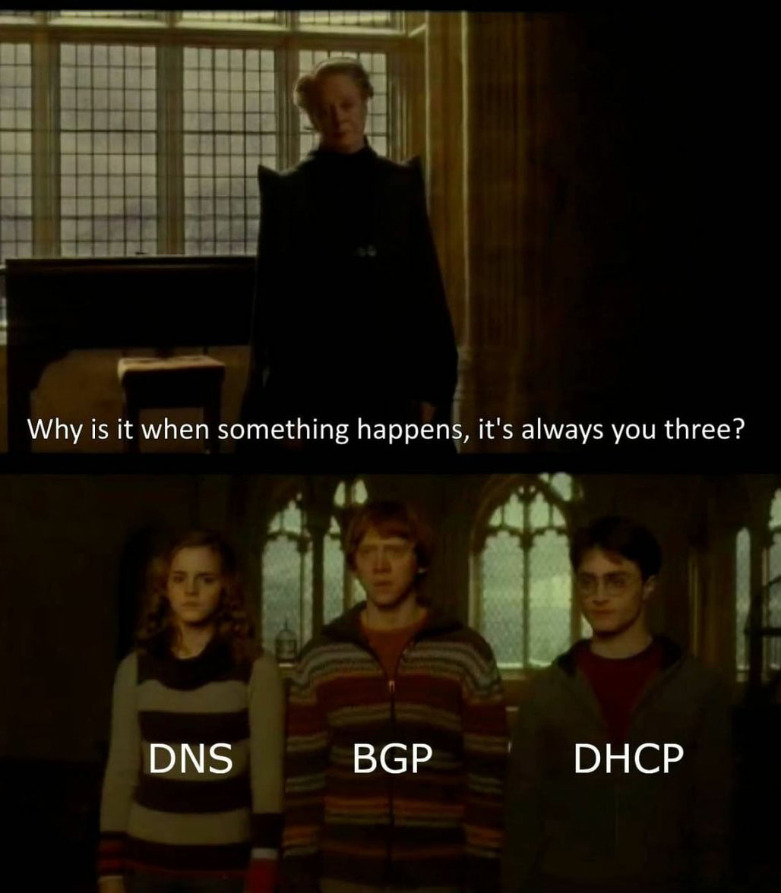
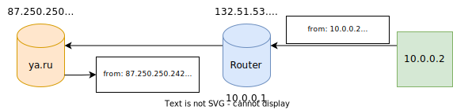
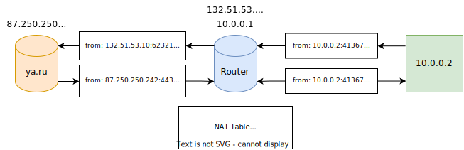

<style>
img[alt~="center"] {
  display: block;
  margin: 0 auto;
}
img[alt$=">"] {
  float: right;
  clear: none;
}
.columns {
  display: grid;
  grid-template-columns: repeat(2, minmax(0, 1fr));
  gap: 0.5rem;
}

section {
    padding-bottom: 0;
    padding-top: 0;
    padding-left: 50px;
    padding-right: 50px;
}

</style>

# Компьютерные сети, ч. 3

---

# DHCP
* Адреса интерфейсов можно назначать вручную, однако это неудобно
* DHCP = Dynamic Host Configuration Protocol
* В IPv6 DHCP заменён SLAAC (Stateless address autoconfiguration)

---

# DHCP: DORA


---

# Автономные сети
- _«AS – это система IP-сетей и маршрутизаторов, управляемых одним или
  несколькими операторами, имеющими единую политику маршрутизации с Интернетом»_
  © Wiki
- Блоки IP подсетей выдаются автономным сетям
- Точка обмена трафиком – точки обмена трафиком между разными AS
- Одна из самых крупных в Европе и России – MSK-IX

---

# BGP
- Как операторам AS обновлять маршруты?
- Border gateway protocol
- Устанавливается между BGP-роутерами соседних AS
- Каждая AS анонсирует свои *префиксы* (подсети)
- Изменения распространяются по всему интернету
- Каждая AS выбирает самый «короткий» маршрут до остальных AS
- Таблица маршрутизации Интернета очень большая: на текущий момент 900k+
  префиксов

---

<div class="columns">
<div>



</div>
<div>

* [Understanding how Facebook disappeared from the Internet](https://blog.cloudflare.com/october-2021-facebook-outage/)
* [Cloudflare outage on June 21, 2022](https://blog.cloudflare.com/cloudflare-outage-on-june-21-2022/)

</div>
</div>

---

## Как LAN с приватными адресами связать с глобальной сетью?



---

# NAT
* Network address translation
* Идея: будем выделять по порту на новые соединения и преобразовывать адреса отправителя на роутере
* Маппинг будем хранить в специальной таблице на роутере



---

## Full-cone NAT
* `(INT_ADDR, INT_PORT) <=> (EXTERNAL_ADDR, INT_PORT, *, *)`
* В обратную сторону пакеты будут направляться от любых пар адрес-порт
* Port forwarding

## (Address-)restricted-cone NAT
* `(INT_ADDR, INT_PORT) <=> (EXTERNAL_ADDR, INT_PORT, REM_ADDR, *)`
* В обратную сторону пакеты будут направляться, если клиент уже открывал соединение до сервера

---

## Port-restricted-cone NAT
* `(INT_ADDR, INT_PORT) <=> (EXTERNAL_ADDR, INT_PORT, REM_ADDR, REM_PORT)`
* В обратную сторону пакеты будут направляться, если клиент уже открывал соединение до сервера до определённого порта

## Symmetric NAT
* `(INT_ADDR, INT_PORT) <=> (EXT_ADDR, EXT_PORT, REM_ADDR, REM_PORT)`
* `EXT_PORT` выбирается случайным образом

---

# NAT traversal
* Проблема: два клиента за NAT хотят установить соединение, как это сделать?
* Для этого используется внешний сервер с общедоступным адресом, который определяет типы NAT'ов
* В зависимости от типов NAT, можно сделать hole punching или нельзя (например, symmetric + symmetric)
* Если NAT traversal возможен (full-cone + restricted-cone), то используется STUN
* Если NAT traversal сделать невозможно, используются выделенные сервера-прокси (TURN)

---

# Как это устроено в Linux: devices
* *Интерфейс* или *устройство* (interface/device) — сущность в ядре, обычно: сетевая карта или loopback интерфейс
* Устройство имеет свой уникальный link-layer address (MAC)
* `ip link`
* Каждое устройство может также иметь несколько network адресов (IP + маска подсети)
* `ip addr`

---

# Как это устроено в Linux: routing tables
* Несколько таблиц маршрутизации (пользователь может задавать вплоть до 252 таблиц)
* `ip route show table <table name>`
* Две встроенные: local и main
* local описывает локальные адреса интерфейсов (которые приземляются на этом же хосте)
* main описывает основную таблицу маршрутизации

---

# Как это устроено в Linux: routing rules
* Правила маршрутизации определяют какие таблицы будут использованы для маршрутизации
* Правила могут матчить по адресу, по порту, по специальной отметке (fwmark), по девайсу, по протоколу
* `ip rule`
* ```
  0:	from all lookup local
  57:	from 10.138.0.0/16 lookup my_table
  32766:	from all lookup main
  32767:	from all lookup default
  ```

---

# Netfilter

<div class="columns">
<div>

* Подсистема Linux для перехвата, мониторига и изменения пакетов сетевого стека
* Состоит из правил (rules), которые объединяются цепочки (chains)
* Цепочки содержатся в таблицах – сущностях, которые применяются на разных этапах обработки пакета

</div>
<div>


</div>
</div>

---

# Таблицы Netfilter

## mangle
* Таблица, в которой можно менять некоторые поля в заголовке IP-пакета
* Например, TTL или помечать специальной меткой (MARK), чтобы в дальнейших правилах её учитывать

## filter
* Таблица для фильтрации пакетов
* Здесь можно, например, просто выбросить пакет, который пришёл от определённого адреса

---

# Таблицы Netfilter

## nat
* Таблица для SNAT/DNAT/MASQUERADE правил

## conntrack
* Stateful firewall
* Позволяет заглядывать внутрь TCP-соединений
* Например, можно парсить первые несколько байт соединения и оверрайдить dstPort в таких пакетах

---

# `iptables`
* CLI для управления netfilter
* `iptables -A INPUT -s 8.8.8.8 -j DROP`
* `iptables -t nat -A POSTROUTING -o eth0 -j SNAT --to 192.168.1.1`
* Более современные аналоги: `nftables`, `ufw`
* [Как создать разные типы NAT с помощью iptables](https://stackoverflow.com/questions/11719572/how-to-simulate-different-nat-behaviours)

---

# iptables под капотом: `ioctl` vs `AF_NETLINK`
* Устаревший способ: `ioctl` для конфигурирования сети (`man 7 netdevice`)
* Современный способ: семейство протоколов `AF_NETLINK`
* `fd = socket(AF_NETLINK, socket_type, netlink_family)`
* `netlink_family` может быть разным:
* * `NETLINK_ROUTE` для замены netdevice (`man 7 rtnetlink`)
* * `NETLINK_NETFILTER` для операций с netfilter

---

# Туннелирование
* Создание «туннеля» между двумя точками через другие сети
* Пакет, который проходит через туннель, помещается (инкапуслируется) в другой пакет, который уже идёт по сети
* Примеры: IPIP туннелирование, GRE (generic routing encapsulation), OpenVPN, Wireguard

---

# Userspace tunneling
* Для туннелирования нужно написать свой модуль в ядро, либо использовать TUN/TAP интерфейсы


---

# Köszönöm!
<span style="color: #ccc; font-size: 25px">«Спасибо» на венгерском языке</span>
